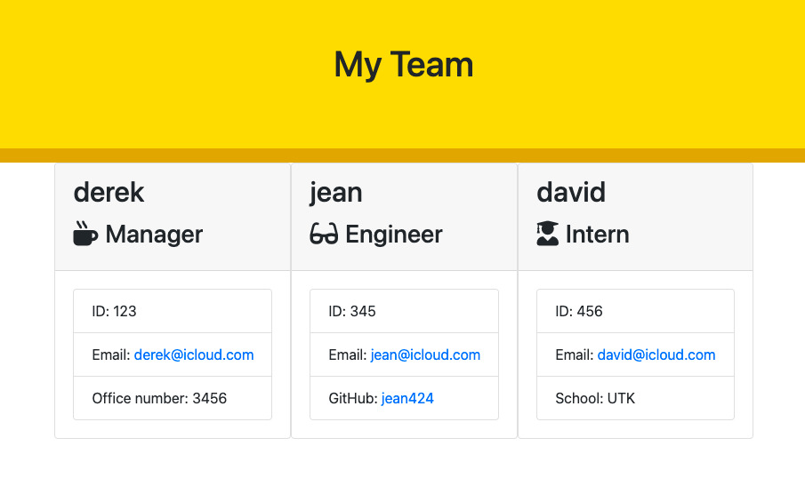

# TeamProfle_Generator

## Project Description
This is a command-line application to make the user get prompted for the required questions and have it succesfully get read file. 

## Table of Contents
- [Installation](#installation)
- [Usage](#usage)
- [Contribution](#contribution)
- [Contact](#contact)

## Installation
This package uses Node and you will need to install Node.js in order to use this application. Just type "npm i" in the terminal in this project's file location.
      
## Usage
To start you will need to navigate to the teamprofile genetator in your terminal using the change directory command (cd). Once you are at the directory you will need to apply the Node package ("npm i" command). Once Node is installed you can run "node index.js" to start up the program. You will then follow the prompts given in the terminal. You can input the name, position, ID number, and Github user name. After the prompts are filled out, the conmandline will output a structured html page that will display all these facts in well organized cards.
      
## Contribution
Please contact me if you would like to contribute something.

## Contact
Feel free to contact me via one of the links below with any questions.
- GitHub: Jean424
- Email: jeanlee.jingli@icloud.com

## Link
- Repo Link: https://github.com/Jean424
- Link to video of the walkthrough: https://watch.screencastify.com/v/5gD0d1LcNCjm8Iq2r2Sh
- Photo of the my team html page:

